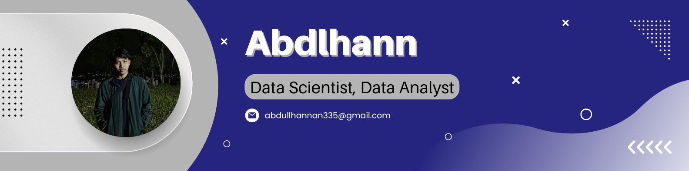

# Hello! I'm  Abdulhann

My Github Profile

🚀 **Data Scientist | Data Analyst | Fullstack Developer **

I love turning data and code into real-world solutions that make an impact.

---

#### 💡 About Me
- 🎓 Passionate about **Data Science, Machine Learning, and Web Development**
- 🧠 Experienced in **Python, Laravel, React, Node.js, SQL**
- 🌍 Open to collaborations in **AI, BI dashboards, and Web Applications**
- 📚 Currently learning **AI and Cloud Deployment (AWS/GCP)**

---

#### Skills

            

---

#### 📫 Connect with me

 

#### My Github Stats

---

#### Play game with me

<picture>
  <source media="(prefers-color-scheme: dark)" srcset="https://raw.githubusercontent.com/Abdlhann/Abdlhann/output/pacman-contribution-graph-dark.svg">
  <source media="(prefers-color-scheme: light)" srcset="https://raw.githubusercontent.com/Abdlhann/Abdlhann/output/pacman-contribution-graph.svg">
  
</picture>

###

